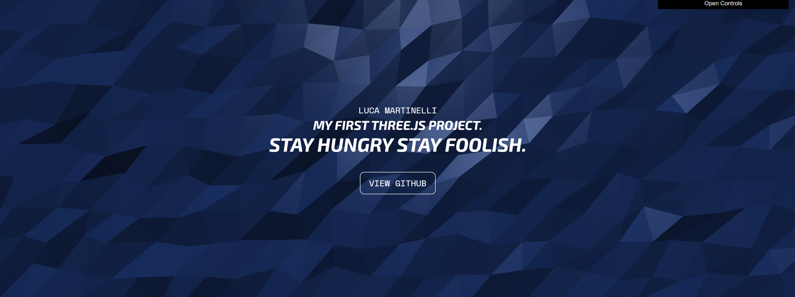
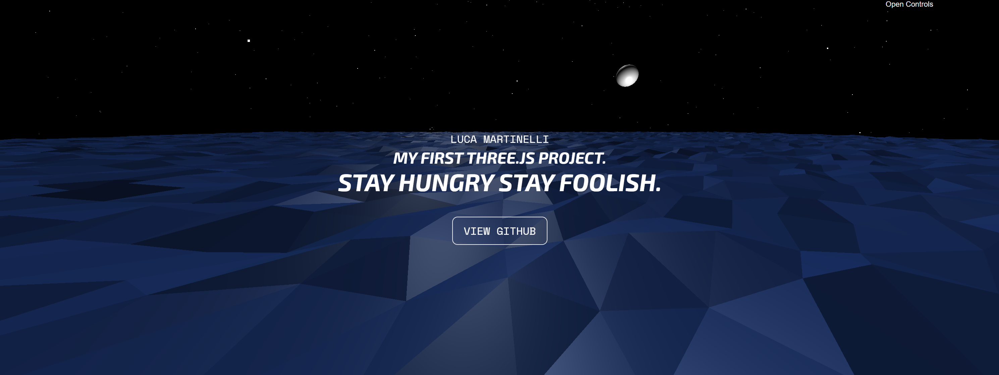

# Three.js First Project

This is a simple project that showcases how to use Three.js, GreenSock, TailwindCSS, and Vite.

## Table of Contents

- Introduction
- Technologies
- Prerequisites
- Installation
- Usage
- License

## Introduction

The project involves the creation of an immersive and engaging user experience based on an animated 3D background.
The fully responsive design also includes the addition of centered text and a button that initiates a custom animation.
The use of dat.gui allows the user to modify the size of the background, the number of faces, and colors.





## Technologies

Three.js is a JavaScript library that makes it easy to create and display 3D computer graphics in a web browser. It provides a simple way to create 3D objects, scenes, and animations, which can be rendered in a canvas element in a web page.

GreenSock is a JavaScript animation library that makes it easy to create complex animations with just a few lines of code. It provides a powerful set of tools for creating animations that can be applied to Three.js objects.

TailwindCSS is a utility-first CSS framework that makes it easy to design responsive websites. It provides a set of pre-defined classes that can be used to style HTML elements without writing custom CSS.

Vite is a build tool that provides fast and efficient development workflows. It uses modern web technologies like ES modules and native JavaScript features to provide a fast and streamlined development experience.

## Prerequisites

To use this project, you will need to have the following software installed on your computer:

- Node.js (version 12 or later)

## Installation

To install the project, follow these steps:

1. Clone the repository: git clone https://github.com/<your-username>/FirstTryThree.js.git
1. Navigate to the project directory: cd FirstTryThree.js
1. Install the dependencies: npm install

## Usage

To run the project, use the following command:

```
npm run dev
```

This will start a development server that you can access in your web browser by navigating to http://localhost:5173.

## License

This project is licensed under the MIT License.
